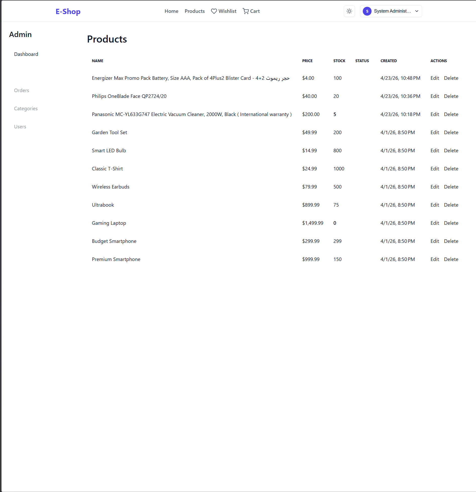
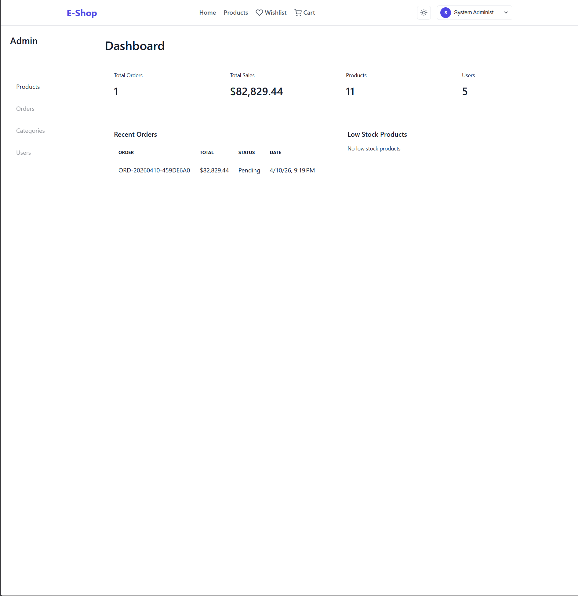

# ECommerce Platform

A production-ready full-stack e-commerce solution built with ASP.NET Core 8 (Clean Architecture) and Angular 21, designed for scalability, maintainability, and exceptional user experience.

## Overview

This project demonstrates a complete e-commerce platform featuring a robust backend API and a modern frontend SPA. It implements industry-standard patterns and practices, making it suitable for both learning and production use cases. The platform includes essential e-commerce functionality such as product catalog, shopping cart, checkout, order management, and user authentication.

## Key Features

### Customer Features
- Product browsing and search
- Detailed product pages with images, ratings, and reviews
- Shopping cart with quantity adjustments
- Secure checkout process
- Order history and tracking
- User authentication (login/register)
- Wishlist functionality
- Responsive design for mobile and desktop

### Admin & Business Features
- Product and category management
- Order management
- Admin Dashboard for business insights (orders, sales, inventory)
- Seller/Merchant Profiles for multi-vendor marketplace
- Payment processing integration
- Role-based access control (Admin/User)
- API documentation with Swagger/OpenAPI
- Health checks and monitoring
- Structured logging
- Database seeding for demo data
- Docker support for easy deployment

### Technical Features
- Clean Architecture backend with CQRS
- Feature-based Angular frontend with standalone components
- JWT-based authentication with refresh tokens
- Entity Framework Core with SQL Server
- TypeScript throughout the frontend
- Unit and integration test coverage
- CI/CD pipeline with GitHub Actions
- Responsive UI with Angular Flex-Layout
- Theme support (light/dark modes)

## Tech Stack

### Backend
- **Framework:** ASP.NET Core 8
- **Architecture:** Clean Architecture with CQRS
- **Database:** SQL Server with Entity Framework Core
- **Authentication:** JWT Bearer tokens with refresh tokens
- **Authorization:** Role-based access control
- **Validation:** FluentValidation
- **Logging:** Serilog
- **API Documentation:** Swagger/OpenAPI 3.0
- **Testing:** xUnit
- **Containerization:** Docker & Docker Compose

### Frontend
- **Framework:** Angular 21
- **Language:** TypeScript
- **Architecture:** Feature-based modules with standalone components
- **State Management:** RxJS services
- **Styling:** SCSS with CSS variables for theming
- **UI Components:** Custom reusable components (product cards, forms, etc.)
- **HTTP Client:** Typed Angular HttpClient with interceptors
- **Routing:** Angular Router with lazy-loading capabilities
- **Forms:** Reactive Forms with validation
- **Build:** Angular CLI with production optimizations
- **Testing:** Jasmine & Karma

### Infrastructure
- **Database:** SQL Server (local or Docker)
- **API Communication:** RESTful JSON over HTTPS
- **Dependency Injection:** Built-in .NET Core and Angular DI
- **Environment Management:** Environment-specific configuration files

## Architecture

### Backend (Clean Architecture)
The backend follows Clean Architecture principles with separate layers of concern:
- **API Layer:** Controllers, middleware, Swagger configuration
- **Application Layer:** Use cases, DTOs, validators, CQRS handlers
- **Infrastructure Layer:** Database contexts, repositories, external services
- **Domain Layer:** Business entities, enums, domain services (zero dependencies)

### Frontend (Feature-Based Angular)
The Angular application uses a feature-based architecture:
- **Core:** Singleton services, guards, interceptors, shared models
- **Features:** Self-contained modules for auth, products, cart, etc.
- **Layout:** Shell components (header, footer, app shell)
- **Shared:** Pipes, directives, utilities used across features
- **Environment:** Configuration files for different deployment targets

## Screenshots

Below are screenshots showcasing the platform's key features and user flows:

### Light Theme


### Dark Theme


### Mobile View


### Additional Features

 *(if applicable)*
 *(Business Insights)*
 *(Marketplace)*

## Getting Started

### Prerequisites
- [.NET 8 SDK](https://dotnet.microsoft.com/download/dotnet/8.0)
- [Node.js 18+](https://nodejs.org/) (for frontend)
- [SQL Server](https://www.microsoft.com/en-us/sql-server/sql-server-downloads) (local or via Docker)
- [Docker](https://www.docker.com/get-started) (optional but recommended)

### Backend Setup

#### Option 1: Local Development
1. Clone the repository
2. Configure the database connection in `src/ECommerce.Api/appsettings.json`:
   ```json
   {
     "ConnectionStrings": {
       "DefaultConnection": "Server=localhost;Database=ECommerceDB;Trusted_Connection=True;TrustServerCertificate=True;MultipleActiveResultSets=true"
     }
   }
   ```
3. Apply EF Core migrations:
   ```bash
   dotnet ef database update --project src/ECommerce.Infrastructure --startup-project src/ECommerce.Api
   ```
4. Run the API:
   ```bash
   dotnet run --project src/ECommerce.Api
   ```
   The API will be available at `http://localhost:5000`

#### Option 2: Docker (Recommended)
1. Ensure Docker is running
2. Start the stack with Docker Compose:
   ```bash
   docker compose up --build
   ```
   This will start:
   - API at `http://localhost:8080`
   - SQL Server at `localhost:1433`

### Frontend Setup
1. Ensure the backend is running (see above)
2. Navigate to the frontend directory:
   ```bash
   cd frontend
   ```
3. Install dependencies:
   ```bash
   npm install
   ```
4. Start the development server:
   ```bash
   npm start
   ```
   or
   ```bash
   ng serve
   ```
5. The application will be available at `http://localhost:4200`

### Environment Configuration
The frontend uses environment files to configure the API base URL:
- `src/environments/environment.ts` (development): `http://localhost:5000/api`
- `src/environments/environment.prod.ts` (production): `/api` (relative to host)

Update these files if your backend runs on a different URL.

## Access Routes

### Frontend Routes
- `/` - Home page
- `/products` - Product listing
- `/products/:id` - Product details
- `/sellers/:id` - Seller profile page
- `/cart` - Shopping cart
- `/checkout` - Checkout
- `/orders` - User orders
- `/wishlist` - User wishlist
- `/login` - Login page
- `/register` - Registration page

### Backend API Endpoints
- `GET /api/sellers` - List sellers
- `GET /api/sellers/{id}` - Seller details
- `GET /api/sellers/{id}/products` - Seller's products
- `GET /api/sellers/products/{productId}/seller` - Product's seller

See API Overview below for complete endpoint documentation.

## API Overview

### Authentication
- `POST /api/auth/register` - Register new user
- `POST /api/auth/login` - Login and receive JWT token
- `POST /api/auth/refresh` - Refresh expired access token

### Products
- `GET /api/products` - List products (with filtering/pagination)
- `GET /api/products/{id}` - Get product details
- `POST /api/products` - Create product (Admin only)
- `PUT /api/products/{id}` - Update product (Admin only)
- `DELETE /api/products/{id}` - Delete product (Admin only)

### Categories
- `GET /api/categories` - List categories
- `GET /api/categories/{id}` - Get category details
- `POST /api/categories` - Create category (Admin)
- `PUT /api/categories/{id}` - Update category (Admin)
- `DELETE /api/categories/{id}` - Delete category (Admin)

### Sellers
- `GET /api/sellers` - List sellers
- `GET /api/sellers/{id}` - Get seller details
- `GET /api/sellers/{id}/products` - Get seller's products
- `GET /api/sellers/products/{productId}/seller` - Get product's seller

### Shopping Cart
- `GET /api/cart` - Get current user's cart
- `POST /api/cart/items` - Add item to cart
- `PUT /api/cart/items/{id}` - Update cart item quantity
- `DELETE /api/cart/items/{id}` - Remove item from cart
- `DELETE /api/cart/clear` - Clear entire cart

### Orders & Checkout
- `POST /api/orders` - Create order from cart
- `GET /api/orders` - Get user's order history
- `GET /api/orders/{id}` - Get specific order details
- `POST /api/checkout` - Process checkout from cart
- `POST /api/payments` - Initiate payment
- `POST /api/payments/{id}/process` - Process payment
- `POST /api/payments/{id}/refund` - Refund payment

### Security
All endpoints except authentication and public product listings require a valid JWT token:
```
Authorization: Bearer <access_token>
```

## Testing

### Backend Tests
- Unit tests for application services, validators, and domain logic
- Integration tests for API endpoints and database interactions
- Run all backend tests:
  ```bash
  dotnet test
  ```

### Frontend Tests
- Unit tests for components, services, and pipes
- End-to-end tests using Cypress or Playwright (planned)
- Run frontend unit tests:
  ```bash
  cd frontend
  npm test
  ```

## Project Highlights

### Why This Project Stands Out
1. **Production-Ready Architecture:** Clean Architecture backend with clear separation of concerns ensures maintainability and scalability.
2. **Full E-Commerce Flow:** Complete implementation from product browsing to order fulfillment, including payment processing.
3. **Modern Technology Stack:** Utilizes latest stable versions of .NET 8, Angular 21, Entity Framework Core, and TypeScript.
4. **Quality Focus:** Comprehensive testing, structured logging, and API documentation demonstrate professional development practices.
5. **Deployment Ready:** Docker support and CI/CD pipeline enable consistent deployments across environments.
6. **Portfolio Quality:** Clean codebase, responsive design, and attention to UX details make it suitable for showcasing to employers or clients.
7. **Extensible Foundation:** Modular architecture allows for easy addition of features like wishlist, reviews, or admin dashboards.

## Future Enhancements

### Planned Improvements
- **AI Shopping Assistant:** Integrate natural language search and product recommendations
- **Payment Gateway Extensions:** Stripe, PayPal, and other popular payment processors
- **Email Notifications:** Order confirmations, shipping updates, and promotional campaigns
- **Advanced Filtering:** Enhanced product search with faceted navigation and sorting
- **Inventory Management:** Stock tracking, low-stock alerts, and supplier management
- **Performance Optimization:** Caching strategies (Redis) and CDN integration for static assets
- **Internationalization:** Multi-language support and currency localization
- **Progressive Web App (PWA):** Offline capabilities and installable mobile experience
- **Accessibility Improvements:** WCAG 2.1 compliance for inclusive design

## Folder Structure

```
.
├── .github/                 # GitHub Actions workflows and templates
├── docs/                    # Documentation and screenshots
│   └── screenshots/         # UI screenshots for README
├── src/                     # Source code
│   ├── ECommerce.Api/       # ASP.NET Core Web API project
│   ├── ECommerce.Application/# Application layer (CQRS, DTOs, services)
│   ├── ECommerce.Domain/    # Domain layer (entities, enums, logic)
│   ├── ECommerce.Infrastructure/# Infrastructure layer (EF Core, repositories)
│   └── frontend/            # Angular SPA
│       ├── src/
│       │   ├── app/         # Application modules and components
│       │   ├── assets/      # Static assets (images, icons, etc.)
│       │   ├── environments/# Environment configuration files
│       │   └── styles/      # Global styles and themes
├── tests/                   # Test projects
│   ├── ECommerce.Application.Tests/
│   ├── ECommerce.Domain.Tests/
│   └── ECommerce.Infrastructure.Tests/
├── docker-compose.yml       # Docker Compose definition
├── Dockerfile               # Multi-stage Dockerfile for API
├── README.md                # This file
└── .gitignore               # Git ignore rules
```

---
*Built with ❤️ using modern .NET and Angular technologies. Designed for developers who value clean architecture, maintainable code, and beautiful user experiences.*